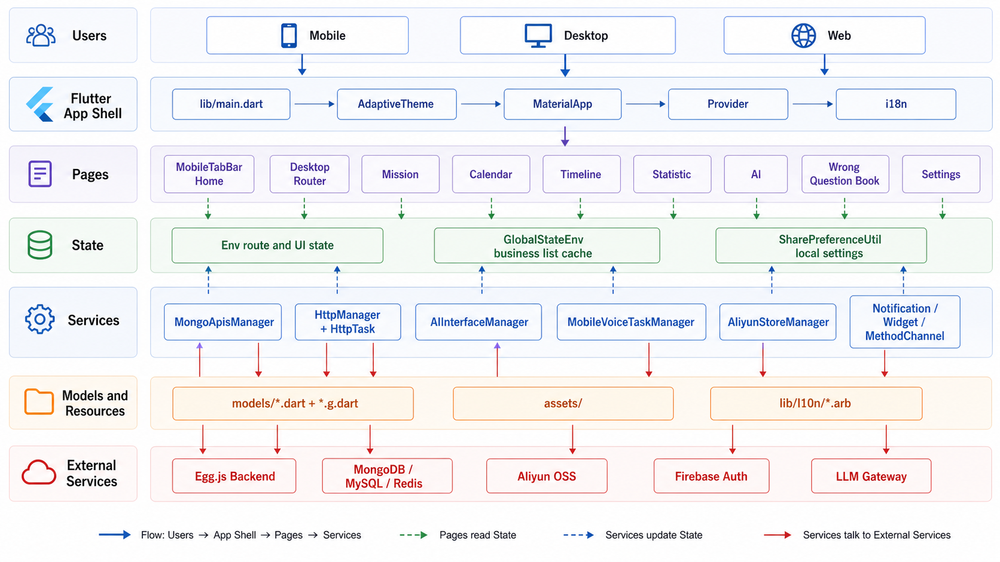
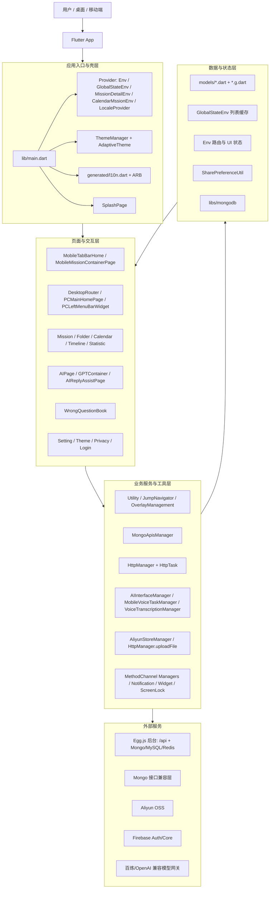

# Efficient Time / TimeHello 项目架构说明

> 更新时间：2026-06-06  
> 适用范围：`/Users/linzhibin/Desktop/work/project/flutter/efficientTimeFinal/efficientTime5/efficientTime`

本文用于快速理解当前 Flutter 客户端的真实架构。它不是重构蓝图，而是按现有代码整理出的模块边界、启动链路、数据流和维护规则。

## 0. GenImage2 视觉版架构图

> 精确结构以本文 Mermaid 图和代码路径为准。GenImage2 视觉图用于快速沟通，局部小字可能存在渲染偏差。

## 1. 项目定位

本仓库是一个 Flutter 多端客户端，应用包名/工程名为 `time_hello`，产品侧包含番茄任务、日历、时间线、统计、四象限、错题本、AI 助手、录音转任务、富文本、游戏、课程、信用卡管理、桌面组件等能力。项目同时覆盖 Android、iOS、macOS、Windows、Web，多端平台目录分别位于：

- `android/`
- `ios/`
- `macos/`
- `windows/`
- `web/`

主要业务代码集中在 `lib/com/timehello/`。第三方或本地 fork 依赖集中在 `thirdPartyPackages/`、`thirdPartyLib/`，静态资源集中在 `assets/`。

## 2. 总体分层

## 3. 启动链路

入口文件是 `lib/main.dart`。

启动时主要做这些事：

1. `WidgetsFlutterBinding.ensureInitialized()` 初始化 Flutter 运行环境。
2. 非 Web 端启用 `WakelockPlus`，避免计时/专注场景被系统休眠打断。
3. 初始化 `SharePreferenceUtil`，读取本地设置、语言、主题等缓存。
4. 非小米渠道初始化 Firebase。
5. 通过 `MultiProvider` 注入全局状态：
   - `LocaleProvider`
   - `MissionDetailEnv`
   - `Env`
   - `GlobalStateEnv`
   - `CalendarMssionEnv`
6. `MyApp` 使用 `AdaptiveTheme` 和 `MaterialApp` 构建应用壳，接入国际化、导航、EasyLoading、Navigator observer。
7. 用户同意隐私协议后，`initThirdparty()` 才继续初始化通知、Mongo、设备信息、统计事件、计时器等能力。

这个顺序很重要：涉及设备 ID、通知、统计、Bugly/Firebase 等敏感能力时，应保持在隐私同意之后初始化。

## 4. 状态管理

项目主要使用 `provider`。

### 4.1 `Env`

文件：`lib/com/timehello/common/provider/Env.dart`

`Env` 更偏 UI 状态和路由状态，包含：

- 桌面主内容区：`routerMainContainerData`
- 桌面内容区内部页面：`routerData`
- 移动端 Tab：`curMobileTab`
- 右侧详情区：`routerRightSideData`
- 当前用户、设置、VIP、文件夹选择态等

桌面端页面切换大量依赖 `Env`，不是传统 Navigator 栈。因此新增桌面页面时，应优先确认是写 `routerMainContainerData` 还是 `routerData`。

### 4.2 `GlobalStateEnv`

文件：`lib/com/timehello/common/provider/GlobalStateEnv.dart`

`GlobalStateEnv` 更偏业务数据缓存，保存任务、清单、时间线、统计、错题本、课程、账单、AI 聊天等列表数据。`MongoApisManager` 拉取或更新数据后，会同步写回这里，页面再通过 Provider 刷新。

常见缓存列表包括：

- `listMissionModels`
- `listFolderModels`
- `listTimelineMissionModel`
- `listStatsModels`
- `listFlomoMissionModel`
- `listWQBFolderModel`
- `listWQBMissionModel`
- `listChatGptMessageModel`
- `calendarModel`

## 5. 页面与路由结构

页面集中在 `lib/com/timehello/page/`。

移动端以底部 Tab、Navigator 栈和页面容器为主，例如：

- `MobileTabBarHome`
- `MobileMissionContainerPage`
- `MissionPage`
- `calendarPage/CalendarPage`
- `MinePage`

桌面端核心在：

- `DesktopRouter.dart`
- `PCMainHomePage.dart`
- `PCLeftMenuBarWidget.dart`
- `Utility.pushDesktopMainContainerNavigator(...)`
- `Utility.pushDesktopNavigator(...)`

桌面端可以粗略分成两层：

1. 主菜单层：左侧菜单 + 主内容区，通过 `Env.routerMainContainerData['page']` 切换。
2. 内容区内部层：不带左侧菜单的局部详情/编辑页面，通过 `Env.routerData['page']` 切换。

维护规则：

- 主菜单切页：使用 `Utility.pushDesktopMainContainerNavigator(...)`。
- 内容区内部跳页：使用 `Utility.pushDesktopNavigator(...)`。
- 回到桌面内容默认页：清空 `Env.routerData`。
- 新增桌面主页面时，同步检查 `DesktopRouter`、`PCLeftMenuBarWidget`、设置开关和埋点。

## 6. 数据访问链路

### 6.1 统一 HTTP

文件：`lib/com/timehello/common/httpclient/HttpManager.dart`

`HttpManager` 基于 Dio 封装：

- `doGetRequest(...)`
- `doPostRequest(...)`
- `doStreamRequest(...)`
- `uploadFile(...)`
- `uploadImage(...)`

请求任务由 `HttpTask` 执行，支持 observer、缓存开关、错误 toast、gzip 解码、语言和登录 token 等能力。普通业务接口不要绕过它重写 Dio，除非目标是外部模型网关等独立鉴权服务。

### 6.2 Mongo 风格数据层

文件：`lib/com/timehello/common/database/apis/MongoApisManager.dart`

`MongoApisManager` 是 Flutter 客户端最核心的数据访问聚合层。它负责：

- 初始化 Mongo 兼容层。
- 维护多类业务列表缓存。
- 加载任务、清单、时间线、统计、错题本、账单、课程等数据。
- 写入后同步 `GlobalStateEnv`。
- 登录、登出或用户切换时 reset 数据。

模型集中在 `lib/com/timehello/models/`，大量模型配套 `*.g.dart`。涉及 Mongo 模型、Egg model、collection、Flutter query manager 时，必须按 `docs/知识库/MongoDB模型生成与查询对齐规范.md` 做三端对齐。

### 6.3 本地缓存

文件：`lib/com/timehello/util/SharePreferenceUtil.dart`

本地配置、语言、主题、隐私协议、部分缓存快照走 `shared_preferences` 封装。启动阶段先初始化它，因此很多全局设置都默认依赖该工具。

## 7. AI 与语音能力

AI 能力主要分两条线：

1. App 内 AI 工具调用：`AIInterfaceManager`
2. 移动端语音创建任务：`MobileVoiceTaskManager`、`VoiceTranscriptionManager`

`AIInterfaceManager` 定义 TimeHello 宿主工具，包括创建/删除/更新/查询任务、清单、统计、时间线、HTML 报表等。AI 回复如果需要改变真实业务数据，应通过这些工具落到 `MongoApisManager` 和本地缓存，而不是只在聊天内容里“说完成了”。

`MobileVoiceTaskManager` 会先判断语音文本是否需要 AI 模式。普通短句直接创建任务；含日期、清单、优先级、多任务等复杂描述时，调用百炼/OpenAI 兼容 `chat/completions`，优先使用 Function Calling 生成标准 MissionModel 参数，再调用 `AIInterfaceManager` 创建任务。

## 8. 上传、录音与平台能力

上传链路主要有两类：

- 普通业务上传：`HttpManager.uploadFile(...)` / `uploadImage(...)`
- 阿里云 OSS 直传：`AliyunStoreManager.uploadFileByFilePath(...)`

OSS 临时凭证来自后台接口 `Apis.getOssToken`，上传目标 bucket 为 `timehello`，URL 通过 `Params.mOssUrl` 拼接。

平台能力分布在多个 Manager：

- 通知：`NotificationManager`
- 桌面/移动组件：`WidgetManager`
- 计时与后台：`CounterManagement`、`TickTimeManager`
- 原生通信：`libs/methodChannel/CounterMethodChannelManager`
- 锁屏：`ScreenLockManager`
- 登录：`LoginManager`、`FirebaseAuthManager`、`AliOneKeyLoginManager`

这类能力通常存在平台差异，修改前要确认 Android/iOS/macOS/Web 是否都适用。

## 9. 配置与资源

核心配置目录：

- `lib/com/timehello/config/Params.dart`：环境、接口、模型、渠道等全局参数。
- `lib/com/timehello/config/ENUMS.dart`：页面、业务状态、模式枚举。
- `lib/com/timehello/config/CONSTANTS.dart`：常量和页面序号。
- `lib/com/timehello/config/StylesConfig.dart`、`ColorsConfig.dart`、`DimensConfig.dart`：样式尺寸配置。

资源目录：

- `assets/img/`：图片、图标、Lottie、背景等。
- `assets/fonts/`：字体。
- `assets/opencc/`：OpenCC 资源。
- `assets/festival/`、`assets/timezone/`：节假日和时区数据。

新增资源后需要同步 `pubspec.yaml`，并至少在一个目标平台验证加载。

## 10. 后台边界

当前仓库是 Flutter 客户端。以下问题优先去 Egg.js 后台仓库排查：

`/Users/linzhibin/Desktop/work/project/bff/code/trunk2/trunk/egg`

优先排查后台的场景：

- 数据库位置、库名、账号、连接方式。
- MongoDB / MySQL / Redis 的集合、表、键、配置。
- 接口返回逻辑、服务端数据结构、爬虫入库、后台任务。
- “这条数据从哪里来”“为什么数据库里没有/有这条数据”。

客户端只在确认服务端数据和接口逻辑后，再看字段适配、页面展示和缓存同步。

## 11. 新功能落点建议

| 需求类型 | 优先修改位置 | 注意事项 |
| --- | --- | --- |
| 新增页面 | `lib/com/timehello/page/` | 桌面端同步 `DesktopRouter`、菜单、路由状态 |
| 新增组件 | `lib/com/timehello/components/` 或页面内 `components/` | 复用现有主题、BaseWidget、Provider |
| 新增模型 | `lib/com/timehello/models/` | 使用 build_runner 生成 `*.g.dart`，同步 Egg model 和 collection |
| 新增接口 | `HttpManager` / `MongoApisManager` | 优先复用现有封装，不直接手写 Dio |
| 上传文件 | `HttpManager` 或 `AliyunStoreManager` | 音频等大文件优先 OSS 直传 |
| AI 工具 | `AIInterfaceManager` | 工具参数必须使用 TimeHello 标准模型字段 |
| 录音任务 | `RecorderPage`、`VoiceTranscriptionManager`、`MobileVoiceTaskManager` | 先预览/确认，再上传或创建业务数据 |
| 暗黑模式 | `ThemeManager` | 页面背景、卡片、文字、输入框、弹窗一起适配 |
| 国际化 | `lib/l10n/*.arb` | 修改后重新生成 `lib/generated/*` |

## 12. 维护风险点

- `Utility.dart`、`MongoApisManager.dart`、部分页面文件职责较重，修改时要做小范围变更，避免顺手重构扩大风险。
- 桌面路由不是 Navigator 栈，很多“返回/关闭”实际是清空 Provider 状态。
- `GlobalStateEnv` 是页面刷新关键路径，数据写入后如果没同步 Provider，页面可能显示旧缓存。
- 模型字段必须和后台 className、collection、Flutter model、query manager、UI 字段保持一致。
- AI 创建任务必须走宿主工具和标准字段，不能只依赖模型自然语言回复。
- App Store、Firebase、OSS、百炼 API Key 等属于环境状态，文档里不要写真实密钥。

## 13. 一句话架构图

TimeHello 当前架构可以概括为：

> Flutter 多端 UI 通过 Provider 承载页面状态和业务缓存，页面层调用 Manager/Utility 完成导航、网络、Mongo 兼容数据读写、AI 工具调用、上传和平台能力，后端数据与配置由 Egg.js / Mongo / Redis / OSS / Firebase / LLM 网关共同提供。
