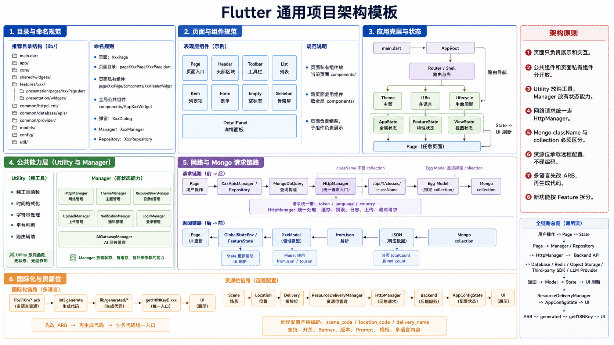
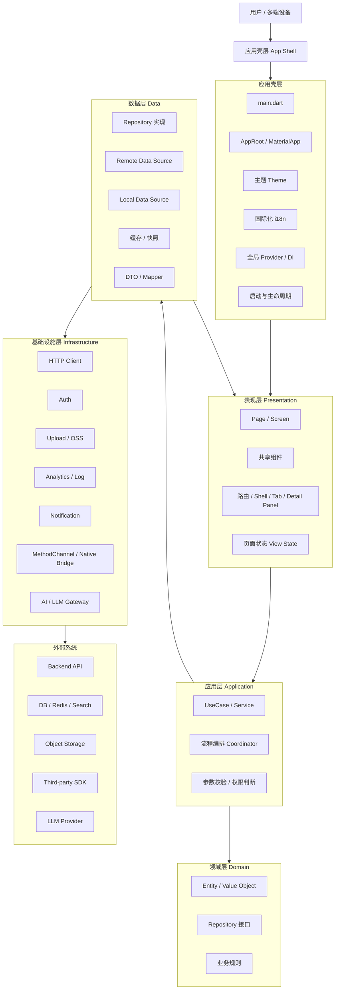
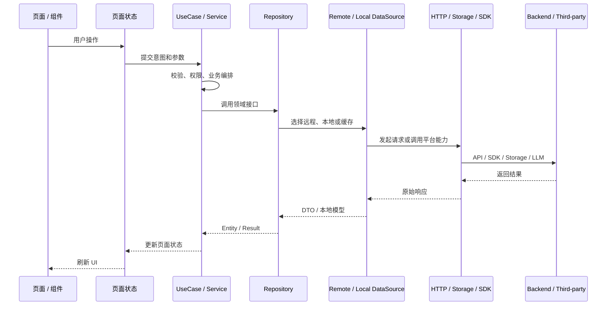
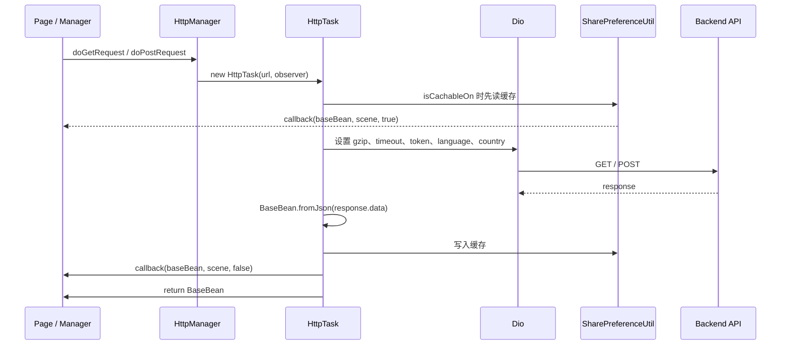
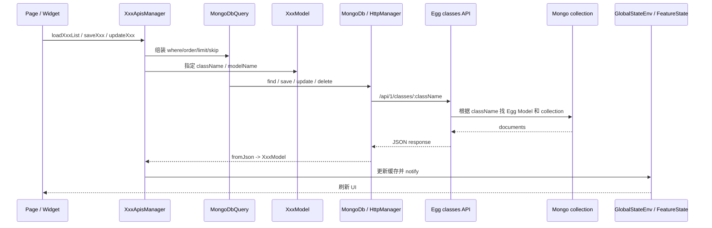
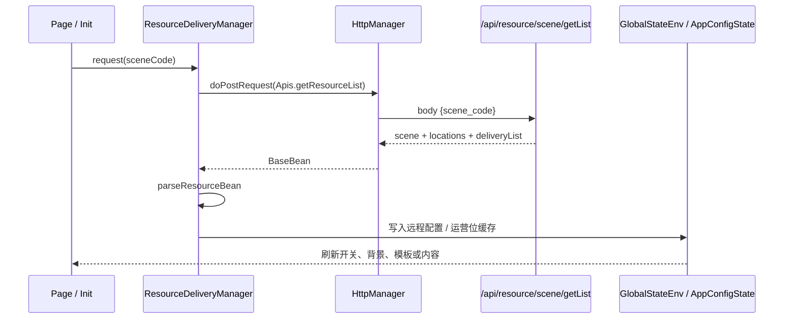

创建日期：260606

# Flutter 通用项目架构模板

## 1. 文档信息

- 目标：给其他 Flutter 项目复用的客户端架构参考
- 当前参考项目：`/Users/linzhibin/Desktop/work/project/flutter/efficientTimeFinal/efficientTime5/efficientTime`
- 当前分支：`feature/newUI`
- 架构图路径：`docs/流程图/feature-newUI/流程图-Flutter通用项目架构-GPTImage2-v3.png`
- GPT Image 2 Prompt：`docs/流程图/feature-newUI/GPTImage2-Prompt-流程图-Flutter通用项目架构.md`
- 生成状态：已生成
- 用途边界：通用 Flutter 架构模板 / 工程初始化参考，不绑定某个具体业务 App



> GPT Image 2 视觉图用于快速沟通。中文图中文字由图像模型渲染，若局部小字存在偏差，以本文 Markdown 结构和 Mermaid 图为准。

## 2. 设计目标

这套架构的重点不是复刻某个项目的业务页面，而是提炼一套可以迁移到其他 Flutter 项目的工程组织方式：

- 支持移动端、桌面端、Web 等多端形态。
- 页面、状态、业务服务、数据访问、平台能力分层清楚。
- 新功能能按 feature 拆分，避免所有代码堆到一个页面或工具类。
- 网络、缓存、上传、登录、主题、国际化、埋点、原生能力都有统一入口。
- 服务端、数据库、OSS、AI 模型等外部能力通过网关层隔离，页面不直接依赖底层实现。
- 复杂桌面端或平板端可以使用“Shell + Router State + Detail Panel”的组合，而不是所有跳转都塞进 Navigator 栈。

## 3. 推荐目录结构

```text
lib/
  main.dart
  app/
    app.dart
    app_router.dart
    app_theme.dart
    app_providers.dart
    app_lifecycle.dart
  core/
    config/
    constants/
    error/
    http/
    i18n/
    logging/
    platform/
    storage/
    theme/
    utils/
  shared/
    widgets/
    models/
    extensions/
    services/
  features/
    feature_a/
      presentation/
        pages/
        widgets/
        state/
      application/
        use_cases/
        coordinators/
      domain/
        entities/
        repositories/
      data/
        dto/
        repositories/
        remote/
        local/
    feature_b/
      ...
  infrastructure/
    api/
    database/
    upload/
    auth/
    analytics/
    notification/
    ai/
    native_bridge/
```

如果是旧项目，不需要一次性重构到这个目录。更稳的做法是：新增功能按这个结构落地，旧功能逐步迁移。

## 4. 当前项目可复用的目录落地规则

如果团队希望沿用当前项目这种组织方式，可以按下面的更贴近现有工程的目录规范落地。它比纯 Clean Architecture 更接近实际 Flutter 多端业务项目，学习成本低，适合从现有项目迁移。

```text
lib/com/<app>/
  components/                 # 全局公共组件
  page/                       # 页面与页面私有组件
    XxxPage/
      XxxPage.dart            # 页面入口，类名 XxxPage
      components/             # 只服务当前页面的子组件
        XxxHeaderWidget.dart
        XxxListWidget.dart
        XxxItemWidget.dart
      pages/                  # 当前模块下的二级页面
        XxxDetailPage.dart
      models/                 # 当前模块私有 UI model
      state/                  # 当前模块私有状态
      services/               # 当前模块私有服务
  common/
    httpclient/               # HttpManager / HttpTask / Observer
    database/apis/            # MongoApisManager 或 feature 专属 Mongo manager
    provider/                 # Env / GlobalStateEnv 等全局 Provider
    i18n/                     # 国际化辅助
  config/                     # Params / Apis / Urls / ENUMS / CONSTANTS / Styles
  models/                     # 可持久化或跨模块使用的业务模型
  beans/                      # 后端响应、资源位、轻量 DTO
  util/                       # Utility、Manager、跨页面公共能力
```

### 4.1 `components/` 放什么

`components/` 只放“跨页面复用”的 UI 或交互组件。

适合放进 `components/`：

- 通用按钮、输入框、搜索框、Tab、标题、空态、Loading、弹窗。
- 多个页面都会用到的选择器、日期选择、颜色选择、图标选择。
- 全局 Shell 组件，比如桌面左侧菜单、顶部菜单、通用返回组件。
- 与具体页面弱绑定的展示组件，比如头像、会员 Banner、通用统计卡片。

不适合放进 `components/`：

- 只在一个页面出现的列表项、Header、局部工具栏。
- 强依赖某个页面状态或某个页面私有 model 的组件。
- 临时试验组件。

命名建议：

| 类型 | 文件名 | 类名 |
|---|---|---|
| 通用组件 | `AppSearchBarWidget.dart` | `AppSearchBarWidget` |
| 通用弹窗 | `ConfirmDialogWidget.dart` | `ConfirmDialogWidget` |
| 通用选择器 | `ColorPickerDialog.dart` | `ColorPickerDialog` |
| 通用布局 | `ResponsiveLayout.dart` | `ResponsiveLayout` |

当前项目历史上存在 `CustomXxxWidget`、`SelectXxxDialogUtil`、`PCXxxWidget` 这类命名。新项目建议进一步收敛：

- `AppXxxWidget`：App 通用组件。
- `XxxDialog`：弹窗 UI。
- `XxxDialogHelper`：只负责弹窗打开/关闭的 helper。
- `DesktopXxxWidget`：桌面端专用组件。
- `MobileXxxWidget`：移动端专用组件。

### 4.2 页面目录怎么命名

页面目录建议使用 `PascalCase`，和页面入口类保持一致：

```text
page/ProfilePage/ProfilePage.dart
page/SettingsPage/SettingsPage.dart
page/ProjectListPage/ProjectListPage.dart
```

页面入口类命名：

```dart
class ProfilePage extends BaseWidget { ... }
class SettingsPage extends BaseWidget { ... }
class ProjectListPage extends BaseWidget { ... }
```

如果页面很简单，可以只有一个文件：

```text
page/AboutPage/AboutPage.dart
```

如果页面变复杂，必须拆子目录：

```text
page/ProfilePage/
  ProfilePage.dart
  components/
    ProfileHeaderWidget.dart
    ProfileActionBarWidget.dart
    ProfileMenuListWidget.dart
    ProfileMenuItemWidget.dart
  state/
    ProfileState.dart
  services/
    ProfileService.dart
```

### 4.3 页面内子组件怎么命名

页面私有组件放在当前页面的 `components/` 下，不放到全局 `components/`。

命名规则：

| 组件职责 | 推荐命名 |
|---|---|
| 顶部区域 | `XxxHeaderWidget` |
| 底部操作区 | `XxxFooterWidget` / `XxxBottomBarWidget` |
| 工具栏 | `XxxToolbarWidget` |
| 列表 | `XxxListWidget` |
| 列表项 | `XxxItemWidget` |
| 表单 | `XxxFormWidget` |
| 空态 | `XxxEmptyWidget` |
| 加载骨架 | `XxxSkeletonWidget` |
| 详情面板 | `XxxDetailPanel` |
| 桌面右侧面板 | `XxxRightPanel` |

拆分原则：

- 一个组件只负责一个区域，不要在 `XxxPage.dart` 里堆所有 UI。
- 子组件通过构造参数接收数据和回调，不直接读取全局状态，除非它本身就是一个状态容器。
- 页面负责组装和协调，子组件负责展示。
- 组件超过约 200-300 行，优先考虑拆成 Header/List/Item/Form/Toolbar。

## 5. 公共方法、Utility 和 Manager 的边界

很多 Flutter 项目后期会变成一个巨大的 `Utility.dart`。可以保留 `Utility`，但要给它明确边界。

### 5.1 `Utility` 放什么

适合放 `Utility`：

- 纯函数：时间格式化、字符串处理、颜色转换、尺寸判断。
- 非业务强绑定的小工具：复制剪贴板、toast、简单弹窗入口。
- 跨端判断：是否手机、是否 Web、是否桌面。
- 路由辅助：移动端和桌面端统一打开/关闭页面的轻量封装。

不适合放 `Utility`：

- 具体业务查询。
- 某个模块的数据保存。
- 复杂状态刷新。
- 直接拼后端接口。
- AI、上传、资源位、登录这类有生命周期和状态的能力。

### 5.2 `Manager` 放什么

`Manager` 适合承载“有生命周期、有缓存、有外部依赖、跨页面复用”的能力。

| Manager 类型 | 负责内容 | 示例命名 |
|---|---|---|
| 网络请求 | 统一 GET / POST / Stream / Upload | `HttpManager` |
| 数据聚合 | 某类模型的加载、保存、缓存同步 | `XxxApisManager` / `XxxRepositoryManager` |
| 用户信息 | 登录态、用户资料、token | `UserInfoManager` / `LoginManager` |
| 资源位 | 远程配置、运营位、开关、内容投放 | `ResourceDeliveryManager` |
| 上传 | OSS、对象存储、文件 URL | `UploadManager` / `OssUploadManager` |
| 通知 | 本地通知、推送、提醒 | `NotificationManager` |
| 主题 | 明暗色、输入框色、文本色 | `ThemeManager` |
| AI | 模型网关、工具调用、结构化输出 | `AIInterfaceManager` / `AiGatewayManager` |

判断标准：

- 如果只是一个静态纯函数，放 Utility。
- 如果需要单例、缓存、初始化、请求、回调，放 Manager。
- 如果只服务一个功能模块，先放 `page/XxxPage/services/` 或 `features/xxx/application/`，不要一开始就放全局 util。

## 6. 总体分层



## 7. 每层职责

| 层级 | 主要职责 | 不应该做的事 |
|---|---|---|
| 应用壳层 | 初始化、主题、国际化、依赖注入、全局导航、生命周期 | 写具体业务流程 |
| 表现层 | 页面布局、交互、组件状态、响应式适配 | 直接拼接口、直接写数据库、堆复杂业务判断 |
| 应用层 | 用例编排、参数校验、权限判断、跨服务流程 | 依赖具体 UI 组件或平台 SDK 细节 |
| 领域层 | 业务实体、业务规则、Repository 抽象 | 引入 Dio、SharedPreferences、MethodChannel |
| 数据层 | Repository 实现、DTO、Mapper、远程/本地数据源 | 让页面直接依赖 DTO 或接口返回原始 Map |
| 基础设施层 | HTTP、上传、登录、埋点、通知、原生桥、AI 网关 | 写业务页面规则 |
| 外部系统 | 服务端 API、数据库、对象存储、第三方 SDK、模型服务 | 被 Flutter 页面直接调用 |

## 8. 推荐数据流



## 9. 页面、路由与多端布局建议

移动端可以优先使用：

- `Navigator` / `go_router` / `auto_route`
- Bottom Tab
- Stack 页面栈
- Modal / BottomSheet

桌面端和平板端建议额外引入 Shell 状态：

- 左侧导航：负责一级模块切换。
- 中间列表区：负责当前模块主要列表、看板或工作台。
- 右侧详情区：负责详情、编辑、预览或辅助面板。
- 路由状态：可以由 Provider / Riverpod / Bloc / Router State 管理。

通用规则：

- 一级模块切换不要和详情页跳转混在一起。
- 主内容区内部跳转要能清理状态并回到默认页。
- URL 路由、桌面窗口状态、移动端 Navigator 可以共存，但要明确职责边界。

### 9.1 BaseWidget 页面基类

README 和知识库里有一个很重要的约束：当前项目的新页面不是直接继承 `StatefulWidget` 写散装页面，而是优先继承 `BaseWidget`。

核心文件：

```text
lib/com/timehello/components/BaseWidget.dart
lib/com/timehello/components/ResponsiveLayout.dart
docs/创建新的Page页面.md
docs/知识库/BaseWidget多端页面设计.md
```

标准页面模板：

```dart
class XxxPage extends BaseWidget {
  const XxxPage({super.key});

  @override
  BaseWidgetState<BaseWidget> getState() {
    return _XxxPageState();
  }
}

class _XxxPageState extends BaseWidgetState<XxxPage> {
  @override
  Widget baseBuild(BuildContext context) {
    return Container();
  }

  @override
  Widget? baseMobileBuild(BuildContext context) {
    return _buildMobile(context);
  }

  @override
  Widget? baseDesktoptBuild(BuildContext context) {
    return _buildDesktop(context);
  }
}
```

`BaseWidget` 的复用价值：

- 统一页面壳、AppBar、SafeArea。
- 统一 Mobile / Tablet / Desktop 的响应式分发。
- 支持 `baseBuild`、`baseMobileBuild`、`baseTabletBuild`、`baseDesktoptBuild` 分层。
- 提供 `onCreate()`、`componentDidMount()`、`onDes()`、`didOnSizeChangeWidget(...)` 等页面生命周期入口。
- 避免每个页面自己判断一堆 `Utility.isHandsetBySize()`。

迁移到其他项目时，建议保留这套页面基类思想：

```text
components/BaseWidget.dart        # 当前项目写法
或
shared/widgets/AppPage.dart       # 新项目更中性的命名
shared/widgets/ResponsiveLayout.dart
```

规则：

- 大布局差异放 `baseMobileBuild` 和 `baseDesktoptBuild`，不要都塞进 `baseBuild`。
- 手机端需要 AppBar / SafeArea，桌面端默认走工作台布局。
- 订阅、计时器、录音、流式请求等资源在 `onDes()` 释放。
- 尺寸变化只做布局刷新，不要无节制重新请求接口。

### 9.2 桌面端跳转的三套入口

README/知识库里明确区分了三套跳转。其他 Flutter 项目如果要做桌面工作台，也应该保留这个边界。

| 场景 | 当前项目入口 | 状态字段 |
|---|---|---|
| 左侧主菜单切页 | `Utility.pushDesktopMainContainerNavigator(...)` | `Env.routerMainContainerData` |
| 主内容区内部详情 | `Utility.pushDesktopNavigator(...)` | `Env.routerData` |
| 普通独立页面 | `Navigator.push(...)` | Flutter Navigator 栈 |

规则：

- 主菜单切页不要用普通 `Navigator.push`。
- 内容区内部详情不要改 `routerMainContainerData`。
- 新增桌面主页面时，同时检查菜单配置、`DesktopRouter`、默认页、菜单高亮和埋点。
- 回到主内容默认页时，通常是清理 `Env.routerData`，不是盲目 pop。

## 10. 状态管理建议

可以使用 Provider、Riverpod、Bloc、GetX 或其他方案，但建议分成三类状态：

| 状态类型 | 示例 | 生命周期 |
|---|---|---|
| App 全局状态 | 用户、主题、语言、登录态、权限、全局配置 | App 生命周期 |
| Feature 状态 | 当前列表、筛选条件、详情数据、分页、加载状态 | 功能模块生命周期 |
| UI 临时状态 | 输入框、选中项、展开收起、弹窗状态 | 页面或组件生命周期 |

状态命名建议：

- `AppState`：全局状态。
- `FeatureState`：功能模块状态。
- `ViewState`：页面状态。
- `Controller / Notifier / Bloc`：状态变更入口。

## 11. 国际化规则

国际化要有唯一源头。推荐规则：

```text
lib/l10n/*.arb        # 文案源头，人工维护
lib/generated/*       # 生成产物，不作为首选编辑入口
业务代码              # 统一通过 getI18NKey().xxx 使用
```

标准流程：

1. 先在 `lib/l10n/intl_en.arb`、`lib/l10n/intl_zh_CN.arb` 等 ARB 文件补 key。
2. 再运行国际化生成命令，生成 `lib/generated/*`。
3. 最后在页面和组件里使用统一入口，例如 `getI18NKey().confirm`。

推荐约束：

- 页面里不要混用 `S.of(context).xxx` 和 `getI18NKey().xxx` 两套入口。
- 如果 WebView / TS / 原生插件也要多语言，仍然让 Flutter 外层从 ARB 取文案，再通过参数或 bridge 传进去。
- 不要直接改 `lib/generated/*` 后忘记回写 ARB；下一次生成会把手工修改冲掉。
- 文案 key 用业务语义命名，不用页面位置命名。例如 `delete_confirm_title` 比 `button_text_1` 更好。

示例：

```dart
Text(getI18NKey().confirm)
Text(getI18NKey().num_items(count))
```

## 12. 网络、缓存与模型

推荐统一封装网络层：

- 所有 API 走统一 `HttpClient` 或 `ApiClient`。
- 请求自动带 token、语言、设备信息、版本号。
- 错误统一转成 `Result / Failure`。
- 支持超时、重试、取消、日志和必要缓存。
- 页面不能直接 new Dio 或手写 `http.post`。

推荐模型分层：

- `DTO`：接口返回结构。
- `Entity`：业务使用结构。
- `Mapper`：DTO 和 Entity 转换。
- `ViewModel`：页面展示结构，可按需从 Entity 派生。

缓存策略：

- 首屏可先读本地快照，再后台刷新。
- 写操作成功后必须刷新相关缓存或局部更新状态。
- 列表接口避免携带大字段，大字段走详情接口。
- 缓存 key 必须包含用户、分页、筛选、语言等业务维度。

### 12.1 HttpManager / ApiClient 规范

当前项目的网络层不是简单包一层 Dio，而是由两层组成：

```text
HttpManager   # 对页面、Manager 暴露的统一入口
HttpTask      # 真正创建 Dio、拼 URL、带 header、处理缓存和错误
BaseBean      # 统一响应结构
```

迁移到其他 Flutter 项目时，建议优先复制或重写成同等结构：

```text
lib/com/<app>/common/httpclient/HttpManager.dart
lib/com/<app>/common/httpclient/HttpTask.dart
lib/com/<app>/common/httpclient/Observable.dart
lib/com/<app>/common/httpclient/Oberver.dart
lib/com/<app>/beans/BaseBean.dart
lib/com/<app>/config/Params.dart
lib/com/<app>/config/CONSTANTS.dart
```

页面和业务 Manager 只调用 `HttpManager`，不要直接碰 `HttpTask` 或 `Dio`。

```dart
BaseBean result = await HttpManager.getInstance().doGetRequest(
  '/api/user/info',
  params: {'userId': userId},
  isCachableOn: false,
  shouldShowErrorToast: true,
);
```

常用方法：

| 方法 | 用途 |
|---|---|
| `doGetRequest` | GET 查询 |
| `doPostRequest` | POST 写入或复杂查询 |
| `doStreamRequest` | 流式响应、AI 流式输出、长连接读取 |
| `uploadFile` | 普通文件上传 |
| `uploadImage` | 图片上传 |

当前项目 `HttpTask._request()` 已经统一处理：

- `USER-TOKEN`
- `LANGUAGE`
- `Accept-Language`
- `COUNTRY-CODE`
- 超时
- gzip
- 错误 toast
- 请求耗时日志
- `isCachableOn`
- observer / callback

核心实现逻辑：



当前项目的关键实现点：

| 能力 | 当前实现 |
|---|---|
| 单例入口 | `HttpManager.getInstance()` |
| 请求任务 | `new HttpTask(this, url, observer).get/post/stream(...)` |
| baseUrl | `Params.mBaseUrl + url`，如果 url 已经是 `http` 则直接使用 |
| token | `LoginManager.getInstance().userBean?.token` 写入 `USER-TOKEN` |
| 语言 | `DeviceInfoManagement.getLanguage()` 写入 `LANGUAGE` 和 `Accept-Language` |
| 国家 | `DeviceInfoManagement.getCountryCode()` 写入 `COUNTRY-CODE` |
| gzip | `Utility.getGzipDecoder` + `accept-encoding: gzip, deflate` |
| 超时 | `Params.CONNECT_TIMEOUT` / `Params.REQUEST_TIMEOUT` |
| 缓存 | `SharePreferenceUtil.getHttpCache / setHttpCache` |
| 错误提示 | `CONSTANTS.getErrorMessage(code)` + `Utility.showToastMsg` |
| 性能日志 | 非生产环境打印请求耗时 |
| 流式请求 | `doStreamRequest` 使用 `ResponseType.stream` 并通过 callback 分发状态 |

### 12.2 推荐迁移后的网络层目录

如果要让别的项目复用这套网络层，建议抽成更中性的目录：

```text
core/network/
  app_http_manager.dart       # 等价于 HttpManager
  app_http_task.dart          # 等价于 HttpTask
  app_http_observer.dart
  app_response.dart           # 等价于 BaseBean
  app_error_code.dart         # 等价于 CONSTANTS 错误码映射
  app_api_paths.dart          # 等价于 Apis
core/config/
  app_env.dart                # 等价于 Params 里的环境和 baseUrl
core/device/
  device_info_manager.dart
core/auth/
  login_manager.dart
core/storage/
  preference_store.dart       # 等价于 SharePreferenceUtil
```

迁移时不要只复制 `HttpManager.dart` 一个文件，它依赖这些公共能力：

- `Params.mBaseUrl`：接口域名。
- `LoginManager`：用户 token。
- `DeviceInfoManagement`：语言、国家、设备信息。
- `SharePreferenceUtil`：请求缓存。
- `Utility.getGzipDecoder`：gzip 解码。
- `Utility.showToastMsg`：统一 toast。
- `CONSTANTS.getErrorMessage`：错误码文案。
- `BaseBean`：统一响应模型。

### 12.3 页面和 Manager 应该怎么调用

页面不直接请求接口。推荐链路：

```text
Page -> XxxManager / XxxRepository -> HttpManager -> Backend
```

GET 示例：

```dart
Future<BaseBean> loadUserInfo(String uid) {
  return HttpManager.getInstance().doGetRequest(
    Apis.userInfo,
    params: {'uid': uid},
    isCachableOn: true,
    shouldShowErrorToast: true,
  );
}
```

POST 示例：

```dart
Future<BaseBean> saveSettings(Map<String, dynamic> params) {
  return HttpManager.getInstance().doPostRequest(
    Apis.saveSettings,
    params: params,
    isCachableOn: false,
    shouldShowErrorToast: true,
  );
}
```

缓存回调示例：

```dart
HttpManager.getInstance().doPostRequest(
  Apis.getResourceList,
  params: {'scene_code': sceneCode},
  isCachableOn: true,
  callback: (BaseBean baseBean, String scene, bool isFromCache) {
    // isFromCache=true 表示先返回本地缓存，false 表示真实网络返回。
  },
);
```

禁止规则：

- 页面里不要直接 `Dio()`。
- 页面里不要重复拼 token 和语言 header。
- 页面里不要自己做一套错误 toast 和缓存，除非公共网络层确实不支持。
- 不要让每个业务模块自己定义一套响应结构；统一用 `BaseBean / AppResponse`。
- 不要把真实接口地址散落到页面；统一放 `Apis / app_api_paths.dart`。

## 13. MongoApisManager / Repository 如何请求后端

当前项目还有一套可复用价值很高的 Mongo 风格通用数据层。它的核心不是某个业务模型，而是下面这组公共骨架：

```text
MongoDb.dart                 # 定义 host、classes API、通用常量
MongoDbDio.dart              # Mongo classes API 的 Dio 客户端
MongoDbObject.dart           # 所有可持久化模型的基类
MongoDbQuery.dart            # where / order / limit / skip / count 查询构造器
MongoApisManager.dart        # 业务模型的加载、保存、删除、缓存同步入口
GlobalStateEnv.dart          # 全局数据状态
```

如果其他 Flutter 项目也希望复用这套后端通用 CRUD，不要重新手写每个接口。更好的方式是复制这套公共骨架，然后只新增具体 `XxxModel` 和 `XxxApisManager` 方法。

如果项目使用 Mongo 风格通用接口，可以抽象成这个链路：



### 13.1 Flutter 侧写法

推荐把某类模型的数据访问集中到 Manager 或 Repository：

```text
common/database/apis/XxxApisManager.dart
features/xxx/data/XxxRepositoryImpl.dart
```

职责：

- 组装查询条件。
- 调用 `MongoDbQuery<XxxModel>` 或统一 Repository。
- 把返回 JSON 转成 `XxxModel`。
- 写入 `GlobalStateEnv` 或 feature state。
- 处理登录态、deviceId、uid、分页、排序、缓存刷新。

不要让页面直接写：

```dart
MongoDbQuery<XxxModel> query = MongoDbQuery();
```

页面应该调用更高层方法：

```dart
final list = await XxxApisManager.getInstance().loadXxxList();
```

当前项目的 `MongoApisManager` 同时承担三件事：

1. 初始化：登录或拿到 `device_id` 后，批量加载基础数据。
2. 查询：用 `MongoDbQuery<XxxModel>` 拼条件、分页、排序。
3. 状态同步：查询或写入后，把列表同步到 `GlobalStateEnv`，触发 UI 刷新。

典型查询模式：

```dart
Future<List<XxxModel>> queryWhereEqual_xxxModel({
  bool shouldRefresh = true,
  Function? callback,
}) async {
  if (shouldRefresh == false && hasLoadedXxxModels == true) {
    return listXxxModels;
  }

  MongoDbQuery<XxxModel> query = MongoDbQuery();
  query.addWhereEqualTo('uid', LoginManager.getInstance().getUid());
  query.addWhereEqualTo('device_id', device_id ?? '');
  query.skip = 0;
  query.limit = 100000;

  List<dynamic> data = await query.queryObjects();
  listXxxModels = data.map((i) => XxxModel.fromJson(i)).toList();
  hasLoadedXxxModels = true;

  Utility.getGlobalContext().read<GlobalStateEnv>().listXxxModels =
      listXxxModels;

  callback?.call(listXxxModels);
  return listXxxModels;
}
```

典型删除模式：

```dart
Future delete_XxxModel(String objectId) async {
  if (LoginManager.isLogin() == false) {
    Utility.showToastMsg(msg: getI18NKey().loginFirst);
    return null;
  }

  XxxModel model = XxxModel();
  model.objectId = objectId;
  MongoDbHandled handled = await model.delete();

  listXxxModels.removeWhere((item) => item.objectId == objectId);
  Utility.getGlobalContext().read<GlobalStateEnv>().listXxxModels =
      listXxxModels;

  return handled;
}
```

### 13.2 className、collection、modelName 必须区分

三者不能混用：

| 层 | 名称 | 示例 | 用途 |
|---|---|---|---|
| Flutter Model | `XxxModel` | `SkillItemModel` | Dart 类型和 JSON 序列化 |
| Flutter 查询层 | `modelName / className` | `SkillItemModel` | 传给 `/api/1/classes/:className` |
| Egg Model | `app/model/XxxModel.js` | `SkillItemModel.js` | 后端 classes API 找模型 |
| Mongo collection | `collection` | `timehello.skillitemmodel` | 真实数据库集合 |

关键规则：

- Flutter 查询 `/api/1/classes/:className` 用的是 className，不是 collection。
- Egg Model 必须显式指定 collection，不依赖 Mongoose 自动推导。
- 新增模型时，Flutter Model、Egg Model、collection、UI 字段要同步检查。
- 分页 `totalCount` 必须真实 count，不能写死。

### 13.3 MongoDbObject 模型怎么定义

所有需要通过 Mongo 通用接口保存的模型，都应该继承 `MongoDbObject`。

`MongoDbObject` 已经提供：

| 字段 / 方法 | 作用 |
|---|---|
| `objectId` | 映射后端 `_id` |
| `createdAt` | 服务端创建时间 |
| `updatedAt` | 服务端更新时间 |
| `getParams()` | 子类必须实现，作为保存 / 更新参数 |
| `save()` | POST `/api/1/classes/:className` |
| `update()` | PUT `/api/1/classes/:className/:objectId` |
| `delete()` | DELETE `/api/1/classes/:className/:objectId` |
| `getParamsJsonFromParamsMap()` | 去掉 `_id/createdAt/updatedAt/sessionToken`，处理 Pointer、Date、Relation 和空值 |

模型模板：

```dart
import 'package:json_annotation/json_annotation.dart';
import '../libs/mongodb/table/MongoDbObject.dart';

part 'XxxModel.g.dart';

@JsonSerializable()
class XxxModel extends MongoDbObject {
  String? title;
  int? updateTime;

  XxxModel({this.title, this.updateTime});

  factory XxxModel.fromJson(Map<String, dynamic> json) =>
      _$XxxModelFromJson(json);

  Map<String, dynamic> toJson() => _$XxxModelToJson(this);

  @override
  Map<String, dynamic> getParams() {
    return toJson();
  }
}
```

生成规则：

- 保留 `part 'XxxModel.g.dart';`。
- 新增字段后跑 `build_runner`。
- UI 优先读 model 的 getter，不在页面里临时解析一堆 Map。
- 服务端生成字段不要手动塞到保存参数里，`MongoDbObject` 会在保存前移除 `_id / createdAt / updatedAt / sessionToken`。
- 字段如果只是 UI 缓存或派生值，用 `@JsonKey(ignore: true)`。
- 复杂 Map 字段建议封装 getter / setter，在 setter 里同步转成 Bean，避免页面到处 `Map` 解析。

当前项目的 `FolderModel` 可以抽象成下面的模型规范：

```dart
@JsonSerializable()
class FolderModel extends MongoDbObject {
  String? title;
  String? uid;
  String? device_id;

  @JsonKey(ignore: true)
  SomeBean? someBean;

  FolderModel();

  factory FolderModel.fromJson(Map<String, dynamic> json) =>
      _$FolderModelFromJson(json);

  Map<String, dynamic> toJson() => _$FolderModelToJson(this);

  @override
  Map<String, dynamic> getParams() => toJson();
}
```

### 13.4 MongoDbQuery 怎么工作

`MongoDbQuery<T>` 的 `T.toString()` 会变成 className：

```dart
MongoDbQuery<FolderModel> query = MongoDbQuery();
```

最终会请求：

```text
/api/1/classes/FolderModel
```

常用查询能力：

| 方法 / 字段 | 作用 |
|---|---|
| `addWhereEqualTo` | 等于 |
| `addWhereNotEqualTo` | 不等于 |
| `addWhereLessThan` / `addWhereGreaterThan` | 范围查询 |
| `addWhereContains` / `addWhereMatches` | 模糊匹配 |
| `or(List<MongoDbQuery<T>>)` | OR 组合 |
| `and(List<MongoDbQuery<T>>)` | AND 组合 |
| `setOrder` / `setOrderValue` | 排序 |
| `setLimit` / `setSkip` | 分页 |
| `queryObjects()` | 查询列表 |
| `queryObject(objectId)` | 查询单条 |
| `queryCount()` | 查询真实 count |

示例：

```dart
MongoDbQuery<XxxModel> query = MongoDbQuery();
query.addWhereEqualTo('uid', LoginManager.getInstance().getUid());
query.addWhereEqualTo('status', 0);
query.setOrder('update_time');
query.setOrderValue(-1);
query.setSkip(page * pageSize);
query.setLimit(pageSize);

final data = await query.queryObjects();
final list = data.map((i) => XxxModel.fromJson(i)).toList();
```

### 13.5 MongoDbDio 和 HttpManager 的关系

当前项目里有两套网络入口，职责不同：

| 入口 | 用途 |
|---|---|
| `HttpManager` | 普通业务 API、资源位、上传、流式请求 |
| `MongoDbDio` | Mongo classes 通用 CRUD：`/api/1/classes/:className` |

它们都可以底层使用 Dio，但业务含义不同，不建议混在一起。

`MongoDbDio` 负责：

- `baseUrl = MongoDb.mongGoHost`
- `GET / POST / PUT / DELETE`
- Mongo 安全请求头：`X-MongoDb-Application-Id`、`X-MongoDb-REST-API-Key`、`X-MongoDb-Master-Key`
- 加密模式下的 `X-MongoDb-Safe-Sign`
- Mongo 查询缓存 `Params.isMongoDbCacheOn`
- Mongo 请求错误埋点

迁移建议：

- 普通 REST API 继续走 `HttpManager`。
- 通用模型 CRUD 走 `MongoDbObject / MongoDbQuery / MongoDbDio`。
- 页面永远不直接调用 `MongoDbDio`；页面只调用 `XxxApisManager`。
- 如果新项目没有 Egg classes API，就不要强搬 `MongoDbDio`，而是保留 `MongoDbObject + Repository` 的模型规范，把底层替换成自己的 REST API。

## 14. 资源位 / 远程配置 Manager

很多 App 最后都会有远程开关、运营位、初始化配置、背景图、音乐、Prompt 模板、版本配置等需求。不要把这些配置硬编码在 Flutter 里，建议抽象成通用资源位系统。

推荐模型：

```text
Scene      # 一个业务场景或系统配置域
Location   # 场景下的位置 / 分组 / 配置块
Delivery   # 具体投放项 / 配置项 / 内容项
```

客户端 Manager：

```text
GetResourceDeliveryManager / ResourceDeliveryManager
```

推荐调用链路：



适合放资源位的内容：

- App 初始化配置。
- 功能开关。
- A/B 配置。
- 版本门槛。
- 背景图、Banner、铃声、模板。
- Prompt 模板和 AI 角色配置。
- 多语言运营内容。

命名建议：

| 字段 | 命名建议 |
|---|---|
| `scene_code` | 系统或大场景，例如 `app_init`、`home_config` |
| `location_code` | 配置块，例如 `version_info`、`feature_flags`、`banner` |
| `delivery_name` | 具体配置项，例如 `is_ai_enabled`、`ios_min_version` |

客户端规则：

- Manager 负责请求、缓存、解析和失败兜底。
- 页面只消费解析后的配置，不直接拼资源位接口。
- `scene_code`、`location_code`、`delivery_name` 要集中成常量，避免散落字符串。
- 资源位接口要带语言 header，后端可按语言返回配置。
- 写配置后要考虑 Redis 缓存刷新。

## 15. 公共状态管理 Env / GlobalStateEnv

当前项目使用 `Provider + ChangeNotifier` 做公共状态管理。核心不是某个具体业务状态，而是把状态分成两类：

```text
Env             # UI 路由、当前选择、主题/设置、页面可见性等轻量状态
GlobalStateEnv  # 全局数据列表、资源位结果、日历模型等数据状态
```

### 15.1 Provider 注册方式

入口在 `main.dart`，通过 `MultiProvider` 注册：

```dart
runApp(
  MultiProvider(
    providers: [
      ChangeNotifierProvider(create: (_) => LocaleProvider()),
      ChangeNotifierProvider(create: (_) => MissionDetailEnv()),
      ChangeNotifierProvider(create: (_) => Env()),
      ChangeNotifierProvider(create: (_) => GlobalStateEnv()),
      ChangeNotifierProvider(create: (_) => CalendarMssionEnv()),
    ],
    child: MyApp(),
  ),
);
```

迁移到其他项目时，建议把它抽成：

```text
app/app_providers.dart
common/provider/Env.dart
common/provider/GlobalStateEnv.dart
common/provider/FeatureXxxEnv.dart
```

### 15.2 Env 放什么

`Env` 适合放“App 壳层和页面路由相关状态”，例如：

- 当前移动端 tab：`curMobileTab`
- 桌面端主内容路由：`routerMainContainerData`
- 桌面端内部详情路由：`routerData`
- 右侧面板数据：`routerRightSideData`
- 当前选中的列表 / 文件夹 / 分组：`curFolderSelected`
- 页面显示隐藏：`isFolderPageVisible`、`isMiddleMissionPageVisible`
- 用户设置：`settingModel`
- 用户信息：`userInfoModel`
- VIP 状态：`isVip`

写法特点：

```dart
Map get routerData => _routerData ?? {};

set routerData(Map value) {
  _routerData = value;
  notifyListeners();
}
```

迁移规则：

- 路由状态、当前选中项、UI 壳层状态放 `Env`。
- `Env` 里不要放巨大的业务列表，列表放 `GlobalStateEnv` 或 feature state。
- setter 里必须 `notifyListeners()`。
- 如果新值和旧值相同，可以先 return，避免重复刷新。

### 15.3 GlobalStateEnv 放什么

`GlobalStateEnv` 适合放“多个页面都会用到的全局数据集合”，例如：

- `listFolderModels`
- `listMissionModels`
- `listSharePreferenceModel`
- `listChatGptMessageModel`
- `calendarModel`
- `ResourceDeliveryInfoBean` 列表

典型写法：

```dart
List<XxxModel> get listXxxModels => _listXxxModels;

set listXxxModels(List<XxxModel> value) {
  _listXxxModels = value;
  notifyListeners();
}
```

迁移规则：

- 全局缓存列表放 `GlobalStateEnv`。
- 单页面临时状态不要放进 `GlobalStateEnv`。
- 只服务一个模块的状态，优先新建 `XxxFeatureEnv` 或放到 feature state。
- `Manager` 负责写入 `GlobalStateEnv`，页面负责读取和展示。

### 15.4 Manager 如何同步状态

当前项目的典型链路：

```text
MongoApisManager 查询数据
  -> 转成 XxxModel list
  -> 写入自身 listXxxModels 缓存
  -> 写入 GlobalStateEnv
  -> notifyListeners
  -> 页面 Consumer/context.watch 刷新
```

示例：

```dart
final globalState = Utility.getGlobalContext().read<GlobalStateEnv>();
globalState.listXxxModels = listXxxModels;
```

读取方式：

```dart
final list = context.watch<GlobalStateEnv>().listXxxModels;
```

只触发操作、不需要刷新当前 widget 时：

```dart
context.read<Env>().routerData = {
  'PageEnum': PageEnum.detail,
  'objectId': objectId,
};
```

### 15.5 推荐状态分层

| 状态类型 | 放哪里 | 示例 |
|---|---|---|
| App 壳层状态 | `Env` | tab、桌面主路由、详情路由、当前选择 |
| 全局数据缓存 | `GlobalStateEnv` | 跨页面列表、资源位、日历模型 |
| 单功能状态 | `XxxFeatureEnv` / feature state | 当前筛选条件、分页、加载状态 |
| 页面临时状态 | StatefulWidget / 局部 Controller | 输入框、展开收起、临时选中 |
| 持久化配置 | `SharePreferenceUtil` + `SettingManager` | 语言、主题、用户设置 |

### 15.6 其他项目复用建议

如果要把当前项目的状态管理搬到别的 Flutter 项目，建议复制这套思想，而不是原样复制所有业务字段：

```text
common/provider/
  AppShellEnv.dart       # 从当前 Env 抽象而来
  AppDataEnv.dart        # 从当前 GlobalStateEnv 抽象而来
  FeatureXxxEnv.dart     # 某个功能自己的状态
```

命名建议：

- `Env` 可以改名为 `AppShellEnv`，更容易理解。
- `GlobalStateEnv` 可以改名为 `AppDataEnv` 或 `GlobalDataEnv`。
- 单功能状态统一叫 `XxxEnv`、`XxxState`、`XxxNotifier`，不要混用太多风格。

禁止规则：

- 不要所有状态都塞进 `Env`。
- 不要所有列表都塞进 `GlobalStateEnv`。
- 不要在页面里直接改 Manager 的私有列表后忘记 `notifyListeners()`。
- 不要在 setter 里做复杂请求；请求放 Manager，状态类只负责保存和通知。

## 16. 平台能力边界

平台能力统一放在基础设施层，不直接散落到页面：

- 文件上传：`UploadService`
- 本地存储：`LocalStorage`
- 通知：`NotificationService`
- 登录：`AuthService`
- 埋点日志：`AnalyticsService`
- 原生通信：`NativeBridge`
- AI 能力：`AiGateway`
- 权限：`PermissionService`

页面只表达用户意图，例如“上传头像”“保存录音”“生成摘要”，不关心底层是 OSS、Firebase、MethodChannel 还是某个模型服务。

## 17. README / 项目说明里的工程规则

根 README、`Readme-tech.md`、`docs/HttpManager使用说明.md`、`docs/创建新的Page页面.md`、`docs/知识库/BaseWidget多端页面设计.md`、`docs/知识库/页面如何跳转.md` 里有很多不是业务逻辑、但对其他 Flutter 项目非常有用的工程经验。整理成下面这些可复用规则。

### 17.1 常用开发命令

其他项目复用这套架构时，README 里至少应该保留这些命令：

```bash
flutter pub get
flutter run
flutter analyze
flutter test
flutter pub run build_runner build --delete-conflicting-outputs
flutter packages pub run build_runner watch --delete-conflicting-outputs
pub global run intl_utils:generate
```

对应职责：

| 命令 | 用途 |
|---|---|
| `flutter pub get` | 安装依赖 |
| `flutter run` | 启动调试 |
| `flutter analyze` | 静态检查 |
| `flutter test` | 自动化测试 |
| `build_runner build` | 生成 `*.g.dart` 模型代码 |
| `intl_utils:generate` | 从 ARB 生成国际化代码 |

### 17.2 Model 生成规则

README 里多次强调 `build_runner`。在这套架构中，它和 Mongo 模型强相关：

```bash
flutter pub run build_runner build --delete-conflicting-outputs
```

规则：

- 新增 `MongoDbObject` 模型后必须生成 `*.g.dart`。
- 修改字段后必须重新生成，不能手写 `*.g.dart`。
- 如果生成冲突，使用 `--delete-conflicting-outputs`。
- CI 或提交前至少跑一次 `flutter analyze`，避免生成代码和业务代码不同步。

### 17.3 国际化提取规则

README 里记录了项目长期使用的国际化流程：

```bash
pub global run intl_utils:generate
```

迁移后的标准流程：

1. 从代码中提取中文文案。
2. 把中文转成 `key: value` 的 ARB 项，key 使用英文小写下划线。
3. 分别补齐英语、德语、法语、日语、韩语、简体中文、繁体中文等语言文件。
4. 运行 `intl_utils:generate`。
5. 业务代码统一替换成 `getI18NKey().xxx` 或 `getI18NKey().xxx(params)`。

禁止：

- 页面里继续写硬编码中文。
- 只改 `lib/generated/*`，不改 `lib/l10n/*.arb`。
- 同一个页面混用多套国际化入口。

### 17.4 图片和静态资源规则

README 里提到图片资源生成工具 `flutter-img-sync`，它的核心思想是：资源路径不要靠手写字符串散落在页面里。

推荐规则：

```text
assets/images/ 或 assets/img/   # 原始图片资源
pubspec.yaml                    # 注册资源目录
lib/r.dart 或 lib/gen/assets.gen.dart
```

使用方式：

```dart
Image.asset(
  R.assetsImagesDefaultHeadPortrait,
  width: 12,
  height: 12,
);
```

迁移建议：

- 新项目可以继续用 `flutter-img-sync`，也可以换成 `flutter_gen`。
- 目标是一致的：页面不要直接写 `"assets/xxx.png"`。
- 新增资源后必须同步 `pubspec.yaml`。
- 至少在一个移动端或桌面端目标验证资源能加载。

### 17.5 多端构建命令要进入 README

当前 README 保留了 Android、iOS、Windows、Web 的构建命令。新项目也应该把多端构建命令写进 README，而不是靠口头记忆。

Android：

```bash
flutter build apk --release --no-tree-shake-icons
flutter build appbundle --release --no-tree-shake-icons
```

iOS：

```bash
flutter build ios --no-tree-shake-icons
```

Windows：

```bash
flutter build windows
```

Web：

```bash
flutter build web --no-tree-shake-icons
```

说明：

- 当前项目经常使用 `--no-tree-shake-icons`，因为部分 IconData 不是编译期常量。
- Web 构建后的代码在 `build/web`。
- 如果要做体积分析，可以补充 `--analyze-size`。
- 真实发布命令可能因渠道、签名、Renderer、source map、优化等级不同而变化，README 应按项目维护。

### 17.6 第三方 SDK 和平台能力边界

`Readme-tech.md` 记录了很多第三方 SDK、Universal Links、ScreenTime、分享、登录、Firebase、App Store 相关资料。通用架构模板不应该把这些做成业务逻辑，但应该明确它们属于平台能力层。

建议归类：

| 能力 | 推荐位置 |
|---|---|
| 一键登录 / 社交登录 | `util/LoginManager` 或 `infrastructure/auth/` |
| 微信 / QQ / 分享 | `infrastructure/share/` |
| Universal Links / App Links | `infrastructure/deeplink/` |
| Firebase | `infrastructure/firebase/` |
| 通知 | `NotificationManager` / `infrastructure/notification/` |
| ScreenTime / Family Controls | `infrastructure/native_bridge/` |
| App Store / Promote 链接 | `docs/运营素材/` 或发布文档 |

规则：

- 平台能力用 Manager 或 Service 封装，页面不要直接依赖 SDK。
- 需要权限申请、证书、entitlement 的能力，必须写入发布/配置文档。
- 多端支持情况要写清楚，避免 Android/iOS/macOS/Web 混用。

### 17.7 README 中不应迁移到通用模板的信息

README 里也有一些只适合作为本机/本项目备忘的信息，不应写进可复用架构模板：

- 账号、密码、邮箱。
- keystore 密码、key hash、签名值。
- 第三方后台 token、appid、secret。
- 真实生产接口密钥。
- 个人机器路径、临时调试端口和一次性排障记录。

这些信息可以保留在安全的本地凭据系统、私有发布文档或环境变量里，不应该进入可复制给其他项目的架构文档。

## 18. 可迁移落地步骤

1. 先复制公共骨架：`HttpManager / HttpTask / BaseBean / Params / Apis`。
2. 再复制 Mongo 通用骨架：`MongoDb / MongoDbDio / MongoDbObject / MongoDbQuery`。
3. 建立 `Env / GlobalStateEnv` 或重命名后的 `AppShellEnv / AppDataEnv`。
4. 在 `main.dart` 或 `app_providers.dart` 用 `MultiProvider` 注册公共状态。
5. 建立 `BaseWidget / ResponsiveLayout` 页面基类，统一 Mobile / Desktop 分发。
6. 建立 `components/`、`page/XxxPage/components/`、`util/`、`common/` 目录边界。
7. 新增模型时按 `MongoDbObject + JsonSerializable + build_runner` 生成。
8. 新增数据访问时写 `XxxApisManager / XxxRepository`，页面不要直接访问 `MongoDbDio` 或 `Dio`。
9. 新增资源位时写 `scene_code / location_code / delivery_name` 常量，通过 `ResourceDeliveryManager` 读取。
10. 新增功能按 `presentation / application / domain / data` 或当前项目的 `page + components + services + state` 分层。
11. 把开发命令、生成命令、国际化命令、多端构建命令写入 README。
12. 建立真实页面 UI QA、接口测试、模型解析测试的最小闭环。

## 19. 不建议的结构

- 所有页面都直接调用 Dio。
- 页面里直接解析后端原始 Map。
- 所有业务状态都塞进一个全局 Provider。
- 工具类无限膨胀，既做路由又做网络又做业务。
- AI、上传、通知、登录等平台能力散落在各个页面。
- 移动端、桌面端、Web 共用同一套页面布局但没有适配层。
- 旧功能和新功能混在一起，没有 Feature 边界。
- 新项目重新手写网络层，却漏掉 token、语言、缓存、错误提示和性能日志。
- 新项目重新写 Mongo CRUD，却没有复用 `MongoDbObject / MongoDbQuery` 的模型和查询规范。
- `className`、`collection`、Flutter Model 名称没有文档化，导致接口能通但查错集合。
- Manager 改了本地列表，但没有写入 `GlobalStateEnv`，页面不刷新。
- README 里只有发布备忘，没有写清公共架构、生成命令、国际化和多端构建。
- 把账号、签名、密钥等敏感备忘混进通用架构模板。

## 20. 本次 GPT Image 2 生成结果

- 生成工具：GPT Image 2（当前会话内置图片生成入口）
- 图片路径：`docs/流程图/feature-newUI/流程图-Flutter通用项目架构-GPTImage2-v3.png`
- 状态：已生成
- 校验：PNG 文件已落盘；图中不包含本项目具体业务模块，可作为其他 Flutter 项目的通用架构参考
