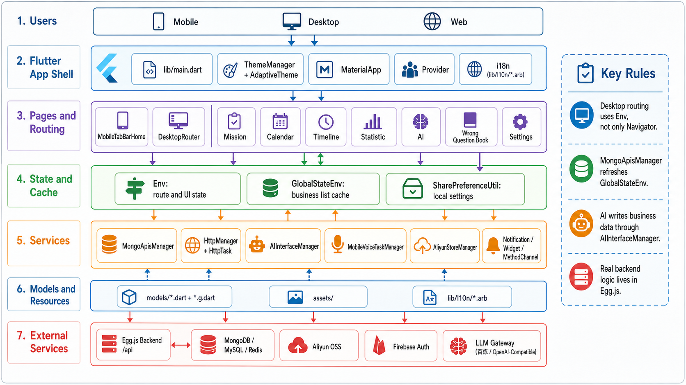
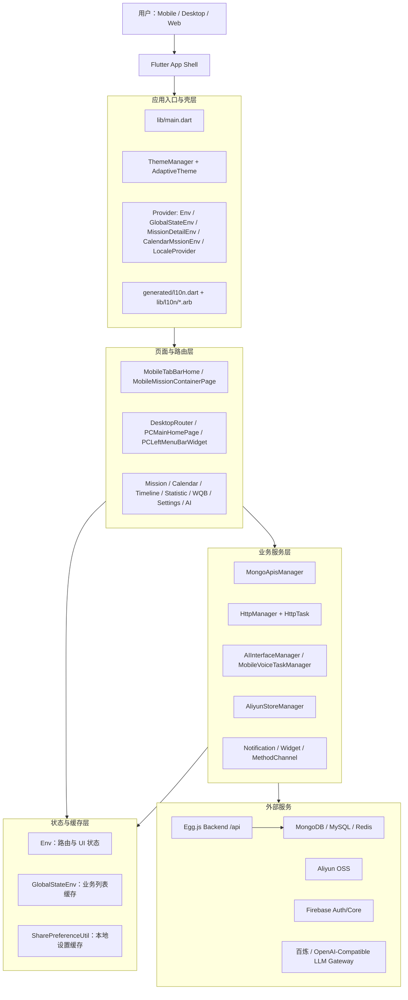
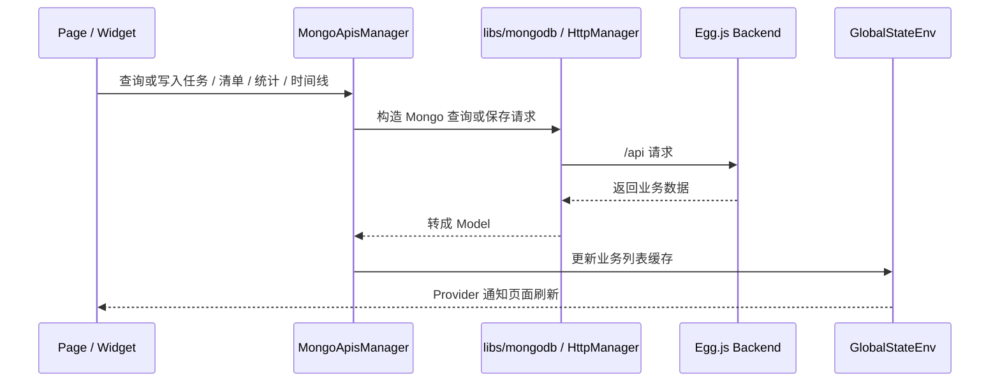
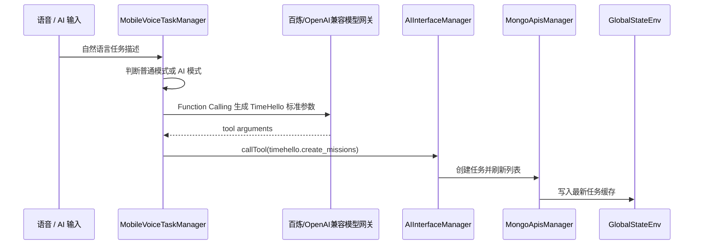

创建日期：260606

# TimeHello / Efficient Time 项目架构说明

## 1. 文档信息

- 项目路径：`/Users/linzhibin/Desktop/work/project/flutter/efficientTimeFinal/efficientTime5/efficientTime`
- 当前分支：`feature/newUI`
- 架构图路径：`docs/流程图/feature-newUI/流程图-TimeHello项目架构-GPTImage2.png`
- GPT Image 2 Prompt：`docs/流程图/feature-newUI/GPTImage2-Prompt-流程图-TimeHello项目架构.md`
- 生成状态：已生成
- 用途边界：工程交接架构图 / AI 参考图，不是运行时拓扑自动扫描结果



> GPT Image 2 视觉图用于快速沟通。图片小字可能存在模型渲染偏差，工程交接以本文代码路径、表格和 Mermaid 图为准。

## 2. 一句话架构

TimeHello 是一个 Flutter 多端单体客户端：页面层通过 Provider 管理路由状态与业务缓存，业务服务层通过 `MongoApisManager`、`HttpManager`、`AIInterfaceManager`、`AliyunStoreManager` 等 Manager 访问后端、模型网关、OSS 和原生能力，数据最终沉淀到 `GlobalStateEnv`、本地缓存和后端 Mongo / MySQL / Redis。

## 3. 真实代码依据

| 类型 | 代码路径 | 作用 |
|---|---|---|
| 应用入口 | `lib/main.dart` | 初始化 Flutter、Provider、主题、国际化、隐私同意后的第三方能力 |
| 全局 UI 状态 | `lib/com/timehello/common/provider/Env.dart` | 桌面路由、移动端 Tab、当前用户、设置、VIP、右侧详情等状态 |
| 全局业务缓存 | `lib/com/timehello/common/provider/GlobalStateEnv.dart` | 任务、清单、统计、时间线、错题本、AI 聊天等列表缓存 |
| 桌面路由 | `lib/com/timehello/page/DesktopRouter.dart` | 桌面主页面和内容区切换 |
| 路由工具 | `lib/com/timehello/util/Utility.dart` | `pushDesktopMainContainerNavigator`、`pushDesktopNavigator` 等桌面跳转封装 |
| 网络封装 | `lib/com/timehello/common/httpclient/HttpManager.dart` | GET / POST / Stream / uploadFile / uploadImage 统一入口 |
| Mongo 数据层 | `lib/com/timehello/common/database/apis/MongoApisManager.dart` | 拉取、写入、重置和同步多类业务数据 |
| AI 工具宿主 | `lib/com/timehello/util/AIInterfaceManager.dart` | 为 App 内 AI 提供任务、清单、统计、时间线等工具调用 |
| 语音建任务 | `lib/com/timehello/util/MobileVoiceTaskManager.dart` | 语音文本判断 AI 模式，并用 Function Calling 生成任务参数 |
| OSS 上传 | `lib/com/timehello/util/AliyunStoreManager.dart` | 获取 OSS 临时凭证并上传文件 |
| 模型目录 | `lib/com/timehello/models/` | Flutter 业务模型与 `*.g.dart` 生成文件 |
| 配置目录 | `lib/com/timehello/config/` | `Params`、`ENUMS`、`CONSTANTS`、样式和环境配置 |

## 4. 分层结构



## 5. 启动链路

1. `lib/main.dart` 调用 `WidgetsFlutterBinding.ensureInitialized()`。
2. 非 Web 端启用 `WakelockPlus`，保障计时和专注场景。
3. 初始化 `SharePreferenceUtil`，读取语言、主题、隐私协议等本地配置。
4. 非小米渠道初始化 Firebase。
5. 通过 `MultiProvider` 注入 `LocaleProvider`、`MissionDetailEnv`、`Env`、`GlobalStateEnv`、`CalendarMssionEnv`。
6. `MyApp` 使用 `AdaptiveTheme` + `MaterialApp` 构建主题、国际化、导航和 EasyLoading。
7. 用户同意隐私协议后，`initThirdparty()` 初始化通知、Mongo、设备信息、事件统计、计时器等能力。

## 6. 页面路由规则

移动端以 `MobileTabBarHome`、`MobileMissionContainerPage` 和 Navigator 栈为主。

桌面端不是纯 Navigator 栈，而是通过 `Env` 切换内容区：

- 主菜单切页：`Utility.pushDesktopMainContainerNavigator(...)` 写入 `Env.routerMainContainerData`。
- 内容区内部跳页：`Utility.pushDesktopNavigator(...)` 写入 `Env.routerData`。
- 关闭桌面内容区内部页面：清空 `Env.routerData`。

新增桌面页面时需要同步检查：

- `DesktopRouter.dart`
- `PCLeftMenuBarWidget`
- 设置开关字段
- 埋点事件
- 默认页和高亮状态

## 7. 数据流

### 7.1 普通业务数据



### 7.2 AI 创建任务



## 8. 外部依赖边界

| 外部能力 | 客户端入口 | 说明 |
|---|---|---|
| Egg.js 后台 | `HttpManager` / `MongoApisManager` | 业务接口、Mongo 兼容接口、OSS token 等 |
| Mongo / MySQL / Redis | 后台仓库 | 客户端不直接维护服务端数据源 |
| Aliyun OSS | `AliyunStoreManager` | 大文件、图片、音频等上传 |
| Firebase | `FirebaseAuthManager` | 登录和 Firebase 初始化 |
| LLM 网关 | `MobileVoiceTaskManager` / `AIInterfaceManager` | 自然语言转业务参数、App 内 AI 工具调用 |
| 原生能力 | `libs/methodChannel/*` 和各类 Manager | 通知、组件、计时、锁屏、系统能力 |

后台相关问题优先到：

```text
/Users/linzhibin/Desktop/work/project/bff/code/trunk2/trunk/egg
```

优先查后台的场景：

- 数据库位置、库名、账号、连接方式。
- MongoDB / MySQL / Redis 的集合、表、键、配置。
- 接口返回逻辑、爬虫入库、后台任务。
- “这条数据从哪里来”“为什么数据库里没有/有这条数据”。

## 9. 维护风险点

- `MongoApisManager.dart` 和 `Utility.dart` 职责很重，修改时要小范围变更，避免顺手重构扩大影响。
- 桌面路由依赖 Provider 状态，返回/关闭经常不是 `Navigator.pop()`。
- 写入数据后必须同步 `GlobalStateEnv` 或触发对应事件，否则页面会显示旧缓存。
- 模型字段需要和 Egg model、Mongo collection、Flutter model、query manager、UI 字段保持一致。
- AI 工具创建真实业务数据时，必须使用 TimeHello 标准字段，不要让模型输出别名字段后直接落库。
- 图片上传、音频上传、录音保存优先复用 `HttpManager` / `AliyunStoreManager`，不要重新写上传链路。

## 10. 本次 GPT Image 2 生成结果

- 生成工具：GPT Image 2（当前会话内置图片生成入口）
- 图片路径：`docs/流程图/feature-newUI/流程图-TimeHello项目架构-GPTImage2.png`
- 状态：已生成
- 校验：PNG 文件已落盘；图中存在个别小字渲染偏差，精确信息以本文 Markdown 和 Mermaid 为准
